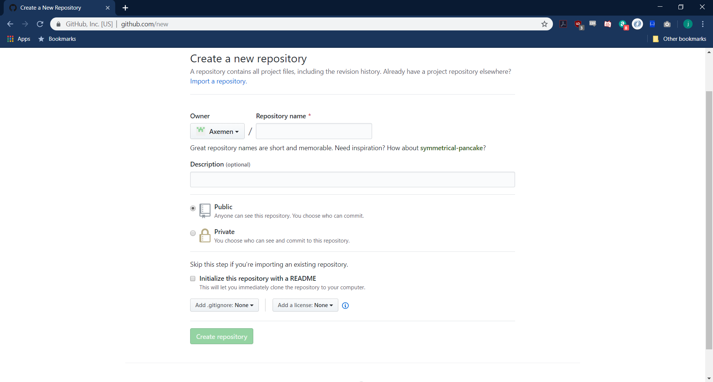
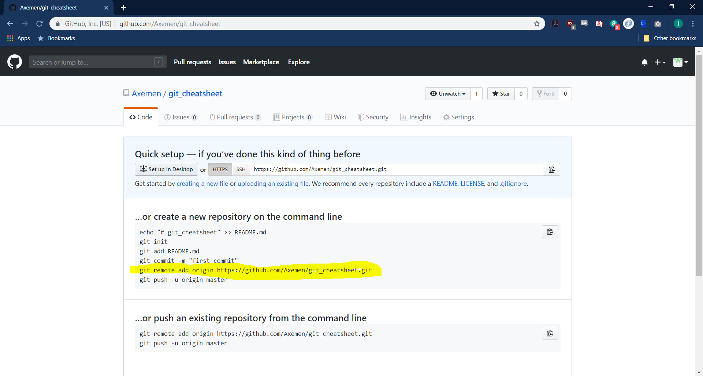
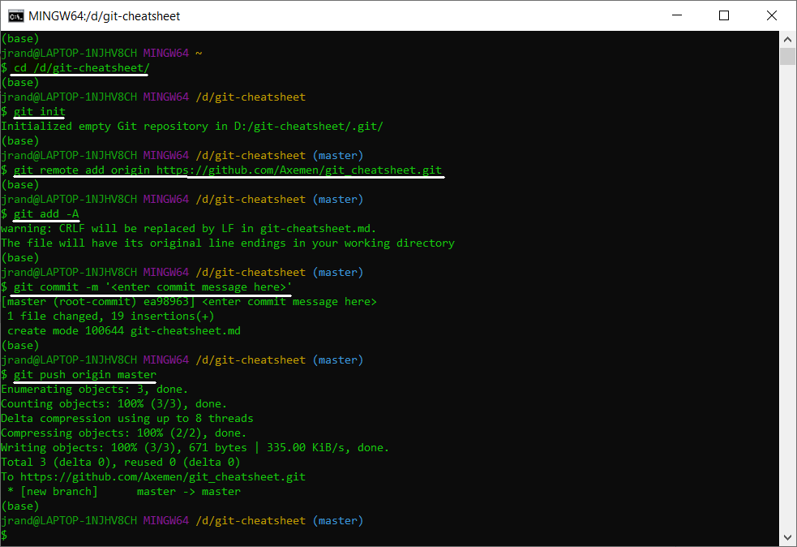

<h1 align = 'center'>Working with git</h1>

<h3 align = 'center'>Creating a GIT Repository</h3>

1. Create a Repository on GitHub.com

2. Copy the link shown below

3. Navigate to the folder in which you whish to create the repository
1. Enter the command `git init` This initializes the local repository on YOUR COMPUTER .
2. Enter the command `git add remote origin <github-url>` (This is hte command we copied from the website) This will set the upstream of your local repository connecting it to the online repository.
3. Enter the command `git add -A` This tracks all the files inside of the added and deleted files inside of the local repository.
4. Enter the command `git commit -m '<message>'` This commits the current changes to your local repository.
5. Enter the command `git push origin master` This pushes your local repository to your online repository.

<h3 align = 'center'>Updating an existing repository</h3>

1. `git add -A` This tracks all the files inside of the added and deleted files inside of the local repository.
2. `git commit -m '<message>'` This commits the current changes to your local repository.
3. `git push origin master` This pushes your local repository to your online repository.

[logo]: images/git-finished-painted.png "Logo Title Text 2"
